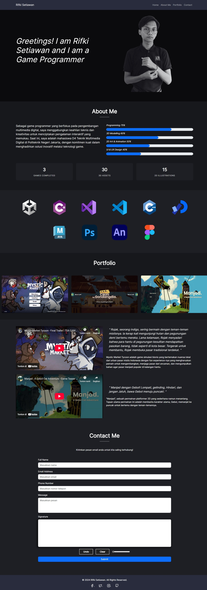

# 🎮 Personal Portfolio

## 🖥️ Overview
✨ **Personal Portfolio** is a web-based portfolio project created as a final assignment for the third semester Web Design course. This site showcases my skills, projects, and contact information as a Game Programmer and Multimedia Digital student. This project is designed to present my professional profile, completed works, and technical abilities in an interactive and visually appealing way. It features a modern dark theme, smooth navigation, and multimedia integration. ✨

## 🚀 Features

- 🌑 Responsive and modern dark-themed design
- 🎬 Smooth navigation with animated transitions
- 📊 "About Me" section with animated skill bars and statistics
- 🖼️ Portfolio gallery with modal image viewer
- ▶️ Embedded YouTube videos for project showcases
- ✍️ Contact form with signature canvas and validation
- 💻 Software and language logos display

## 🛠️ Technology Used

- HTML5 & CSS3
- JavaScript
- [Bootstrap 5](https://getbootstrap.com/)

## 📸 Screenshots

**Portfolio**

**Wireframe**

## 📄 License

This project is licensed under the MIT License. See the [LICENSE](LICENSE) file for details.

## 🙏 Credits

- All images, icons, and fonts are used for educational purposes.
- Developed by Rifki Setiawan as a final project for the Web Design course at Politeknik
